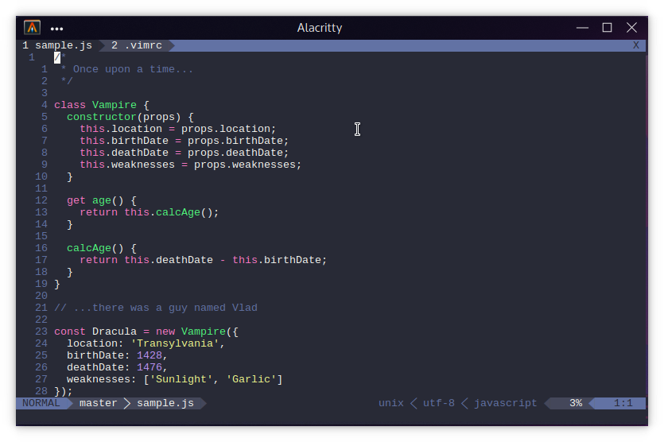

# Dracula for [Lightline](https://github.com/itchyny/lightline.vim)

> A dark theme for [Lightline](https://github.com/itchyny/lightline.vim).

## Install

All instructions can be found at [draculatheme.com/lightline](https://draculatheme.com/lightline).

## Team

This theme is maintained by the following person(s) and a bunch of [awesome contributors](https://github.com/dracula/template/graphs/contributors).

--- | ---
[Natur3-Boy](https://github.com/Natur3-Boy)

## License

[MIT License](./LICENSE)
